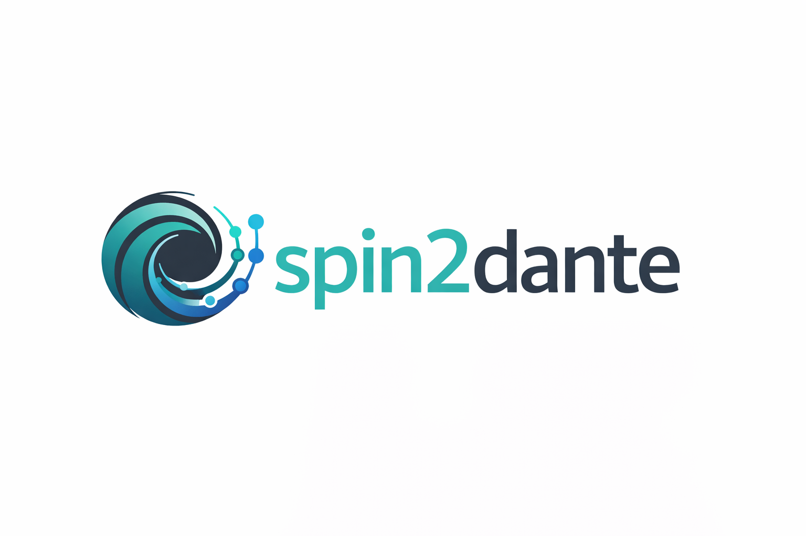

# spin2dante



> **Note**
> This project is experimental. It has been validated with real DANTE hardware
> running as a Home Assistant add-on, and with Music Assistant grouped playback
> across Sonos and DANTE players — the two stay in perfect audible sync.
> Use at your own risk.

Bridge [Sendspin](https://www.sendspin-audio.com/) audio streams to [DANTE](https://www.getdante.com/) network audio receivers.

The primary use case is connecting DANTE-compatible audio devices (amplifiers, receivers, DSPs) to music streamers — in particular [Music Assistant](https://www.music-assistant.io/). Each bridge instance appears as a Sendspin player in Music Assistant and as a DANTE transmitter on the network. You subscribe your DANTE receivers to the bridge's output channels using Dante Controller or `netaudio`. This gives you synchronized multi-room group playback across DANTE zones, controlled from Music Assistant.

spin2dante is a pure protocol bridge. Audio flows directly from the Sendspin WebSocket stream into DANTE network packets — it does **not** pass through the host's audio subsystem (no ALSA, PulseAudio, or PipeWire involved). The implementation is lossless and bit-perfect for PCM audio, running entirely in userspace.

```
Music Assistant
      │ Sendspin (WebSocket)
      ▼
┌──────────┐
│spin2dante│ ← one instance per zone
│  bridge  │
└────┬─────┘
     │ DANTE (unicast/multicast UDP)
     ▼
DANTE Receivers (amplifiers, receivers, etc.)
```

### Key capabilities

- **Unlimited zones** — run one bridge per zone, each appears as a separate DANTE transmitter and Music Assistant player. Tested with up to 16 simultaneous stereo pairs.
- **Sub-millisecond cross-bridge sync** — bridges sharing the same PTP clock and Sendspin server synchronize to within 1-16 samples (0.02-0.33ms). Group playback across zones stays in tight sync without inter-bridge communication.
- **Cross-ecosystem sync with Sonos** — validated with Music Assistant grouped playback spanning Sonos and DANTE players simultaneously; the two ecosystems stay in perfect audible sync.
- **Bit-perfect PCM transport** — the E2E test harness captures the DANTE output from each bridge, aligns it against a deterministic reference signal, and verifies sample-level exact match. The test infrastructure captures their DANTE output via `inferno2pipe`, and performs overlap comparison against a known reference. Both audio integrity (bit-perfect match) and cross-bridge sync are validated.

## Deployment Options

spin2dante supports two deployment models:

1. **Docker Compose on Linux** — run `statime` and one or more `spin2dante`
   containers on any Linux host that can run Docker.
2. **Home Assistant add-on** — install the companion `statime` and
   `spin2dante` add-ons from this repository.

Both options require:

- **DANTE audio devices** on the network (see [clock master](#clock-master-ptp) below)
- **A Sendspin source** — typically [Music Assistant](https://www.music-assistant.io/) with the Sendspin provider enabled

### Option 1: Install in Home Assistant

This repository includes Home Assistant add-ons for both `statime` and
`spin2dante`.

### Add the repository

Open the add add-on repository dialog in your Home Assistant instance:

[](https://my.home-assistant.io/redirect/supervisor_add_addon_repository/?repository_url=https%3A%2F%2Fgithub.com%2Fsalanki%2Fspin2dante)

If the button does not work, add the repository manually:

1. Open Home Assistant.
2. Go to **Settings > Add-ons**.
3. Open the add-on store.
4. Open the menu in the top right and choose **Repositories**.
5. Add `https://github.com/salanki/spin2dante`.

### Install the add-ons

1. Install `statime`.
2. Configure its network and PTP settings for your environment.
3. Start `statime` and confirm it creates the shared clock socket.
4. Install `spin2dante`.
5. Configure one or more bridge entries.
6. Start `spin2dante`.
7. Check the logs for both add-ons.

### Recommended order

- Start `statime` first.
- Start `spin2dante` after the clock is available.
- Then subscribe your DANTE receivers to the `spin2dante` transmitters using Dante Controller or `netaudio`.

### Clock Master (PTP)

DANTE uses PTP (Precision Time Protocol) to synchronize audio clocks across all devices on the network. One device must act as the **PTP clock master** (leader).

**PTPv1 (default — standard DANTE):** Statime runs as a PTPv1 **follower only**. An existing DANTE device on the network must be the clock master. This is the typical setup when you have DANTE amplifiers, receivers, or other hardware on the LAN — they provide the master clock.

**PTPv2 (AES67 networks or no DANTE hardware):** If you have no standard DANTE hardware, you can use PTPv2 mode with two Statime instances: one as **master** (clock reference) and one as **follower** (exports usrvclock for inferno). Only PTP followers export clock overlays — masters don't adjust their clock and never trigger the export callback. See `statime/statime-ptpv2-master.toml` and `statime/statime-ptpv2-follower.toml` for configs. Note that PTPv2 interoperability with DANTE devices requires those devices to have AES67 enabled.

See the [Inferno clocking documentation](https://gitlab.com/lumifaza/inferno#clocking-options) for details.

### Option 2: Run with Docker Compose

For Docker Compose deployment you need:

- **Linux host** with a network interface on the same LAN as the DANTE devices
- **Docker** with Docker Compose

## Quick Start

```sh
# 1. Clone this repo
git clone <repo-url> spin2dante && cd spin2dante

# 2. Configure: set your network interface and edit bridge services
export PTP_INTERFACE=enp1s0  # your DANTE-facing NIC

# 3. Edit docker-compose.yml — uncomment and configure bridge services
#    Each bridge needs a unique PROCESS_ID and ALT_PORT

# 4. Build and start
docker compose up -d

# 5. Verify DANTE devices appeared on the network
pip install netaudio  # or use Dante Controller
netaudio device list
```

## Configuration

Each bridge instance is configured via CLI arguments and environment variables.

### CLI Arguments

| Argument | Default | Description |
|----------|---------|-------------|
| `--url` / `-u` | (required) | Sendspin server WebSocket URL |
| `--name` / `-n` | "Sendspin Bridge" | DANTE device name visible on the network |
| `--buffer-ms` | 5 | Playout buffer / latency in milliseconds. Larger values improve jitter tolerance, but they also add the same amount of audio delay. |
| `--drift-threshold-ms` | 5 | Drift threshold in milliseconds before an in-place anchor correction is applied. |
| `--drift-check-interval-ms` | 1000 | How often to sample drift between the Sendspin and PTP timelines. |
| `--max-correction-samples-per-tick` | 48 | Maximum anchor shift applied in one drift-correction tick. |
| `--client-id` | Derived from name | Stable Sendspin/Music Assistant player identity |

Bridges that should stay sample-aligned with each other should use the same
`--buffer-ms` value.

Bridges that share the same Sendspin timeline and PTP clock will stay tightly
synced even at higher buffer values such as `100ms`, as long as they all use
the same `--buffer-ms` setting. Increasing `--buffer-ms` raises latency for the
whole sync group, but does not by itself create an offset within that group.

For same-host deployments where Sendspin and `spin2dante` run on the same
machine, values as low as `1ms` can work well because the bridge sees very
little upstream jitter. For general deployments, especially when Sendspin is
remote, `5ms` remains the recommended default.

### Clock Drift Correction

Once a bridge is running, it periodically samples the DANTE read position and
the Sendspin server clock. If drift grows beyond `--drift-threshold-ms`, the
bridge shifts its scheduler anchor in place instead of rebuffering, capped by
`--max-correction-samples-per-tick` each check. This keeps long-running bridges
aligned without introducing a prebuffer-sized audible gap.

By default, drift is checked every second and corrected once it exceeds `5ms`.
Large anomalies still fall back to a full rebuffer for safety.

Keep `--max-correction-samples-per-tick` conservative. The default `48`
samples is about `1ms` at 48kHz and is intended to stay comfortably below the
"backward target" rebuffer path. Values above roughly `100` samples increase
the chance that a single correction could force a full rebuffer when chunks are
small.

### Environment Variables

These are passed through to [inferno_aoip](https://gitlab.com/lumifaza/inferno):

| Variable | Required | Description |
|----------|----------|-------------|
| `INFERNO_CLOCK_PATH` | Yes | Path to usrvclock socket (e.g., `/shared/usrvclock`) |
| `INFERNO_PROCESS_ID` | For multiple bridges | Unique ID (0-65535) per bridge on the same host |
| `INFERNO_ALT_PORT` | For multiple bridges | Base UDP port, spaced 10 apart per bridge |
| `INFERNO_SAMPLE_RATE` | No (default: 48000) | Sample rate in Hz |
| `INFERNO_BIND_IP` | No | Network interface or IP to bind to |
| `TMPDIR` | Yes | Must be on a shared volume (see deployment section) |

## Deployment

### Architecture

A production deployment consists of:

1. **Statime** — PTP clock daemon, syncs with the DANTE network's PTP master and exports a synchronized clock via the [usrvclock](https://gitlab.com/lumifaza/usrvclock) protocol
2. **One bridge per zone** — each connects to a Sendspin source and transmits as a DANTE device

All containers run with host networking. Statime needs host networking for accurate PTP timestamps on the real NIC. Bridges need it for DANTE multicast and mDNS device discovery.

### Prerequisites

- At least one DANTE device on the network acting as **PTP clock master** (leader). Statime runs as a PTPv1 follower — it does not act as clock master. Without an existing DANTE PTP leader on the network, clocking will not work.
- The host must be on the same LAN as the DANTE devices (multicast must reach them).
- Identify your DANTE-facing network interface (e.g., `enp1s0`).

### docker-compose.yml

The included `docker-compose.yml` is a production-ready template. Uncomment and duplicate the bridge service examples for your zones:

```yaml
bridge-kitchen:
  <<: *bridge
  command: ["--url", "ws://music-assistant.local:8927/sendspin", "--name", "Kitchen"]
  environment:
    <<: *bridge-env
    TMPDIR: /shared/tmp_kitchen
    INFERNO_PROCESS_ID: "1"
    INFERNO_ALT_PORT: "14000"
```

Each bridge needs:
- **Unique `--name`** — the DANTE device name visible on the network and in Dante Controller
- **Unique `TMPDIR` subdirectory** — for usrvclock client socket isolation (see below)
- **Unique `INFERNO_PROCESS_ID`** — identifies the instance (device ID is auto-derived from host IP + process ID)
- **Unique `INFERNO_ALT_PORT`** — base UDP port for DANTE protocol (space 10 apart: 14000, 14010, 14020, ...)

For Music Assistant / Sendspin player identity:
- **Stable `--client-id`** keeps the same player across restarts
- If omitted, spin2dante derives a stable ID from `--name` and `INFERNO_PROCESS_ID` when present
- Changing `--name` or `INFERNO_PROCESS_ID` changes the derived player identity

### Why TMPDIR must be unique and on a shared volume

Inferno communicates with Statime via [usrvclock](https://gitlab.com/lumifaza/usrvclock), a protocol that uses Unix datagram sockets. Each bridge creates a client socket in `$TMPDIR` (e.g., `/shared/tmp_kitchen/usrvclock-client.1.0`). Statime sends clock overlays back to these socket paths.

Since Docker containers have isolated filesystems (even with host networking), the socket files must be on a **shared volume** visible to all containers. And each bridge needs its **own subdirectory** because all containers typically run their main process as PID 1, which would cause socket name collisions in a shared directory.

### Verifying the Deployment

**Check Statime is synced** (look for "Slave" state — means it found the DANTE PTP master):
```sh
docker compose logs statime | grep "new state"
# Expected: "new state for port 1: Listening -> Slave"
```

**Check DANTE devices are visible:**
```sh
netaudio device list
# Should show your bridge names (Kitchen, Bedroom, etc.) with TX channels
```

### Routing Audio to DANTE Receivers

Once bridges are running and visible, you need to subscribe your DANTE receivers to the bridge's output channels. You can use [Dante Controller](https://www.getdante.com/products/dante-controller/) (GUI) or [netaudio](https://pypi.org/project/netaudio/) (CLI).

**Install netaudio:**
```sh
pip install netaudio
```

**List all devices on the network:**
```sh
netaudio device list
```

**Subscribe a receiver to a bridge (stereo — both channels):**
```sh
netaudio subscription add --tx "01@Kitchen" --rx "01@MyAmplifier"
netaudio subscription add --tx "02@Kitchen" --rx "02@MyAmplifier"
```

Each bridge outputs stereo (channels `01` and `02`). You need to subscribe both channels to get stereo audio on the receiver. The `--tx` argument is `channel@device` for the transmitter (your bridge), and `--rx` is `channel@device` for the receiver (your DANTE amplifier/receiver).

**List active subscriptions:**
```sh
netaudio subscription list
```

**Remove a subscription:**
```sh
netaudio subscription remove --tx "01@Kitchen" --rx "01@MyAmplifier"
```

Subscriptions persist on the DANTE devices — they survive bridge restarts.

**Check audio is flowing** (after subscribing receivers):
```sh
docker compose logs bridge-kitchen | grep "\[buffer\]"
# Healthy: [buffer] fill=2412 target=2400 drift=+1.2ppm ...
# No subscriber: [buffer] no active DANTE subscriber; audio buffered but not being consumed
```

**Check bridge connected to Sendspin:**
```sh
docker compose logs bridge-kitchen | grep "connected\|stream start"
# Expected: "connected to Sendspin server" then "stream start: codec=pcm ..."
```

### Adding or Removing Bridges

Add a new bridge service to `docker-compose.yml` and run:
```sh
docker compose up -d bridge-new-zone
```

Remove a bridge:
```sh
docker compose stop bridge-old-zone
docker compose rm bridge-old-zone
```

Other bridges and Statime are not affected.

### Monitoring

The bridge logs periodic metrics every 5 seconds. Two log lines are emitted: sync status and buffer status.

**Sync status** (scheduler and queue health):
```
[sync] mode=scheduled pending=0 stale_drops=0 trims=0/0 high_water=1
```

| Metric | Meaning |
|--------|---------|
| `mode` | `scheduled` (anchor-based targeting active) or `sequential` (fallback) |
| `pending` | Chunks in the pending queue waiting to enter the ring |
| `stale_drops` | Chunks dropped because their target was behind `read_pos` |
| `trims` | Chunks/frames trimmed (partial overlap with `read_pos`) |
| `high_water` | Peak pending queue depth since stream start |

**Buffer status** (ring buffer fill level):
```
[buffer] fill=2412 target=2400 drift=+1.2ppm write_pos=142880523456 read_pos=142880521056
```

| Metric | Meaning |
|--------|---------|
| `fill` | Samples buffered (write position - read position) |
| `target` | Configured playout delay target (`--buffer-ms` converted to samples) |
| `drift` | Estimated clock drift between Sendspin and PTP in ppm |

During PTP clock warmup, the buffer line shows:
```
[buffer] writing at N samples (read_pos not yet available)
```

## Troubleshooting

| Symptom | Cause | Fix |
|---------|-------|-----|
| `clock unavailable, can't transmit` | Statime not running, not synced, or no PTP master on network | Check `docker compose logs statime`. Ensure DANTE hardware is on the network as PTP master. |
| `no active DANTE subscriber` | No DANTE receiver subscribed to this bridge | Use Dante Controller or `netaudio subscription add` to route channels |
| `rejecting stream: codec 'flac'` | Sendspin source sending FLAC (not yet supported) | Configure source to send PCM. Bridge supports PCM 16/24-bit only. |
| `rejecting stream: sample rate` | Source not at 48kHz | Configure source for 48kHz output |
| `connection failed ... retrying` | Sendspin server not reachable | Check URL, ensure Music Assistant is running |
| `session ended with error ... reconnecting` | Sendspin server restarted or network glitch | Normal — bridge auto-reconnects in 2 seconds |
| Bridge devices not appearing in `netaudio` | mDNS not reaching the network | Ensure host networking mode, check firewall for UDP 5353 |
| Multiple bridges failing at startup | TMPDIR collision or missing PROCESS_ID/ALT_PORT | Ensure each bridge has unique TMPDIR subdir, PROCESS_ID, and ALT_PORT |

## Further Documentation

- **[DESIGN.md](DESIGN.md)** — architecture deep-dive, clock model, state machine, sample format details, lessons learned
- **[TESTING.md](TESTING.md)** — E2E test infrastructure, Docker test environments, running tests

## Credits

This project builds on the work of several open source projects:

- **[Inferno](https://gitlab.com/lumifaza/inferno)** by Teodor Woźniak — unofficial implementation of the DANTE protocol in Rust. spin2dante uses inferno_aoip as its DANTE engine.
- **[sendspin-rs](https://github.com/Sendspin/sendspin-rs)** — Rust implementation of the Sendspin protocol, used for receiving audio streams.
- **[Sendspin](https://www.sendspin-audio.com/)** by the [Open Home Foundation](https://www.openhomefoundation.org/) — the synchronized audio streaming protocol.
- **[Music Assistant](https://www.music-assistant.io/)** — the music streaming platform this project primarily integrates with.
- **[Statime](https://github.com/pendulum-project/statime)** by [Trifecta Tech Foundation](https://trifectatech.org/) / Pendulum Project — PTP (Precision Time Protocol) clock synchronization daemon.

## Legal

Dante uses technology patented by [Audinate](https://www.audinate.com/). This source code may use these patents too. Consult a lawyer if you want to make money from it or distribute binaries in a region where software patents apply.

This project makes no claim to be either authorized or approved by Audinate. The DANTE protocol implementation is provided by [Inferno](https://gitlab.com/lumifaza/inferno), an unofficial and independent implementation.

Dante is a trademark of Audinate Pty Ltd.

## License

Dual licensed under [GPLv3-or-later](https://www.gnu.org/licenses/gpl-3.0.html) and [AGPLv3-or-later](https://www.gnu.org/licenses/agpl-3.0.html). This matches the license of [inferno_aoip](https://gitlab.com/lumifaza/inferno), which spin2dante depends on as a library.
